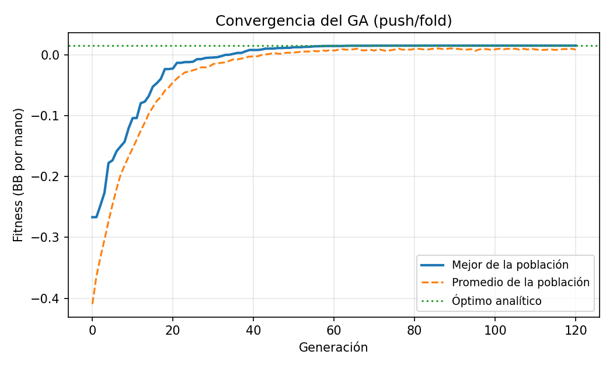
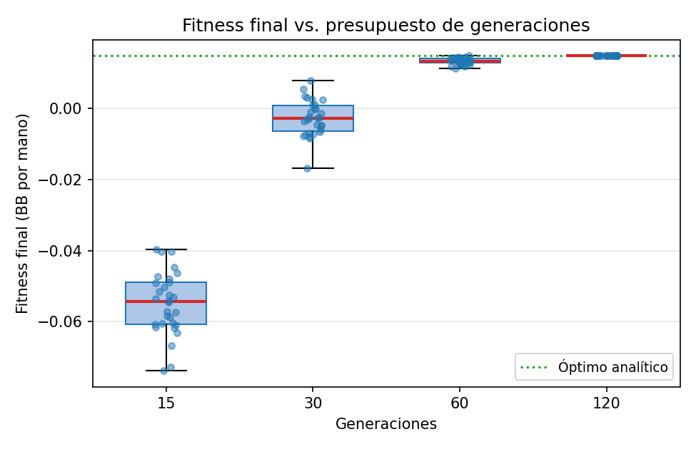
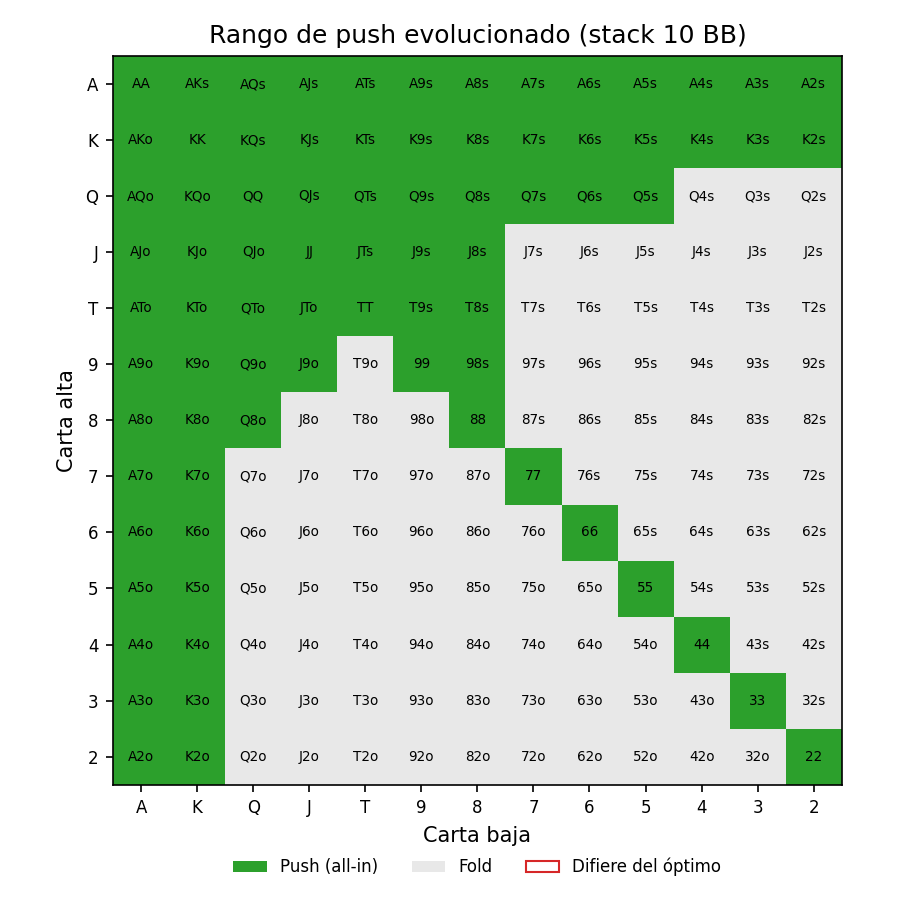

# Optimización de un rango de *push/fold* en póker con un Algoritmo Genético

**Algoritmos Evolutivos I (2026) — Maestría en Inteligencia Artificial, FIUBA**
Desafío Práctico · Técnica: **Algoritmos Genéticos (GA)**

> La consigna original del trabajo está transcripta en [`CONSIGNA.md`](CONSIGNA.md).

Este proyecto usa un **Algoritmo Genético** para encontrar la estrategia óptima de
*push/fold* (ir all-in o retirarse) en **Texas Hold'em heads-up** con stacks cortos,
un problema real de teoría de juegos del póker.

---

## El problema en una frase

En heads-up (1 vs 1) con stacks cortos, la jugada óptima antes del flop se reduce a
**push (all-in) o fold**. Hay que decidir, para cada una de las **169 manos iniciales**
distintas, cuáles pushear. Eso es un rango de push, y existen **2¹⁶⁹** posibles: un
espacio enorme que resolvemos con una metaheurística.

- **Cromosoma:** vector binario de **169 bits** (1 = push, 0 = fold).
- **Fitness:** ganancia esperada en *big blinds* (BB) por mano, calculada con un modelo
  de valor esperado (EV) sobre *equities* reales de póker.
- **Validación:** como el rival (rango de call de la BB) es fijo, el problema es
  separable y su **óptimo se conoce analíticamente**; verificamos que el GA converge
  exactamente a él.

## Resultados

| Convergencia | Diagrama de caja | Rango evolucionado |
|:---:|:---:|:---:|
|  |  |  |

El GA converge de forma estable al **óptimo analítico exacto** (0/169 manos de
diferencia) y recupera un rango con sentido pokerístico: todos los pares, cualquier mano
con un as o un rey, *broadways* y algunos conectores *suited*. El diagrama de caja muestra cómo, al
aumentar el presupuesto de generaciones, la mediana sube hacia el óptimo y la
dispersión entre corridas se reduce.

## Estructura del repositorio

```
.
├── CONSIGNA.md                  # consigna original del TP
├── README.md                    # este archivo
├── requirements.txt
├── data/
│   └── equity_169x169.npy       # matriz de equity precomputada (versionada)
├── src/pushfold/                # código fuente (paquete Python)
│   ├── hands.py                 #   169 clases de mano, pesos y combos
│   ├── equity.py                #   matriz 169×169 de equity all-in (eval7)
│   ├── game.py                  #   modelo del juego push/fold + fitness
│   ├── ga.py                    #   algoritmo genético binario
│   └── plots.py                 #   convergencia, box plot y grilla de rango
├── scripts/
│   ├── precompute_equity.py     # (re)genera la matriz de equity (usa eval7)
│   └── run_ga.py                # corre el GA y guarda las figuras en results/
├── notebooks/
│   └── ae1_pushfold_ga.ipynb    # notebook reproducible (Google Colab)
└── docs/img/                    # figuras del writeup
```

## Cómo correrlo

### Local

```bash
python -m venv .venv && source .venv/bin/activate
pip install -r requirements.txt        # numpy, matplotlib (eval7 solo p/ regenerar)

# Corre el GA y genera las figuras en results/
python scripts/run_ga.py --stack 10 --bb-call 0.5 --runs 30 --generations 120
```

La matriz de equity ya viene versionada en `data/`, así que **no hace falta `eval7`**
para correr el GA. Para regenerarla (por ejemplo con otros parámetros de simulación):

```bash
python scripts/precompute_equity.py --samples 25000
```

### Google Colab (reproducible)

Abrí `notebooks/ae1_pushfold_ga.ipynb` en Colab y ejecutá todo (`Entorno de ejecución →
Ejecutar todas`). La notebook clona este repo, importa `src/pushfold/` y reproduce todas
las figuras.

## Modelo (resumen)

Con stack efectivo `S` (BB), ciega chica 0.5 y ciega grande 1, el EV de la SB es:

- **Fold** → `-0.5`
- **Push y la BB foldea** → `+1.0`
- **Push y la BB paga** → `S·(2·equity − 1)`

El fitness de un cromosoma es la ganancia esperada por mano, ponderando cada mano por
su frecuencia y el rango de call (fijo) de la BB. Detalle completo en
[`src/pushfold/game.py`](src/pushfold/game.py).

## Estado y checklist de entrega

- [x] Script/notebook en Python que resuelve el problema con un GA
- [x] Gráfico de convergencia (obligatorio) + diagrama de caja (opcional)
- [x] Notebook reproducible en Google Colab
- [x] Documento `.pdf` (5 carillas) con la URL del repo → [`docs/AE1-pushfold-GA-informe.pdf`](docs/AE1-pushfold-GA-informe.pdf)
- [x] Repositorio publicado en GitHub

> El informe se regenera con `python scripts/build_report.py --author "Nombre Apellido"`.

## Trabajo futuro (extensión A2)

El rival es fijo, lo que hace el problema separable. La extensión natural es
**coevolucionar** los rangos de push de la SB y de call de la BB (juego de suma cero)
para aproximar el **equilibrio de Nash** de push/fold, donde el problema deja de ser
separable y el GA cobra un rol más rico como buscador de equilibrios.
